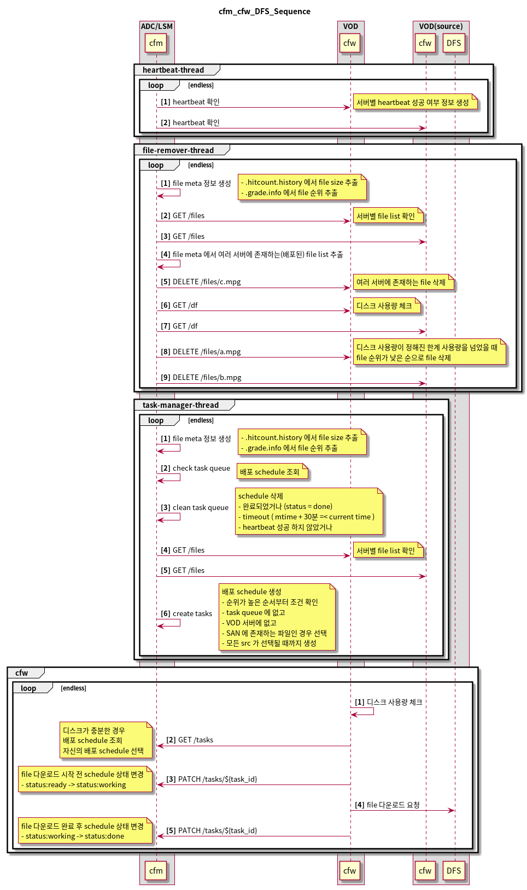
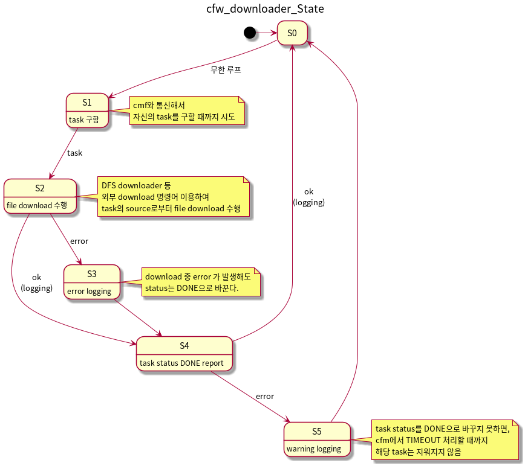
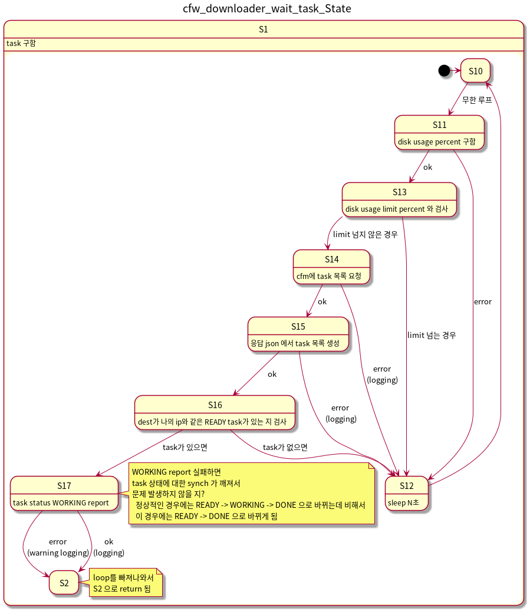
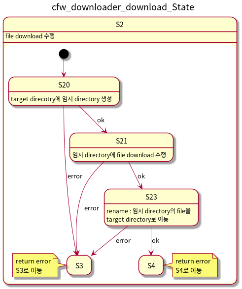

v1.0.0.qr2 / 2020-01-23
===================
### cfm, cfw, DFS Sequence

- 배포 schedule과 task는 같은 의미로 사용됨
- cfw 와 heartbeat 추가
- 여러 서버에 배포된 파일을 한 서버에만 남기고 나머지에서는 제거하는 기능 추가

### cfw downloader State

- cfw 의 내부 모듈인 downloader 상태도

